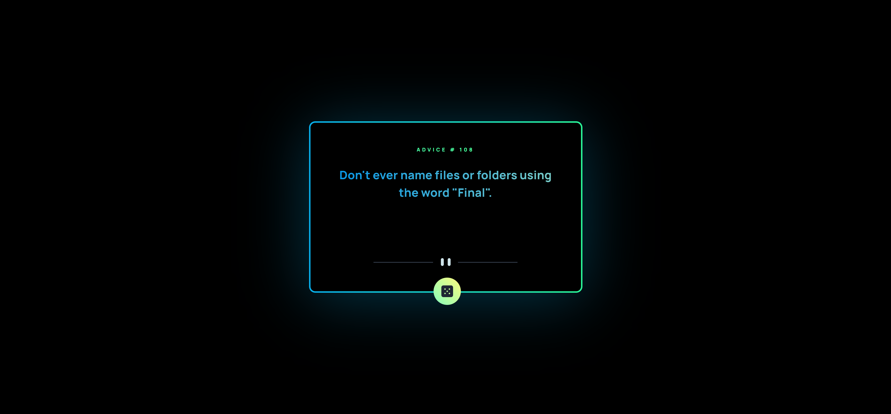

# Advice generator app 🎲

Built advice generator app using the [Advice Slip API](https://api.adviceslip.com).

- View the optimal layout for the app depending on their device's screen size
- See hover states for all interactive elements on the page
- Generate a new piece of advice by clicking the dice icon

### Font

- Family: [Manrope](https://fonts.google.com/specimen/Manrope)
- Weights: 800

## Layout

The designs were created to the following widths:

- Mobile: 375px
- Desktop: 1440px
